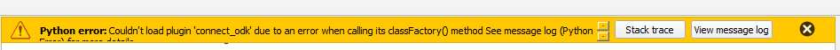
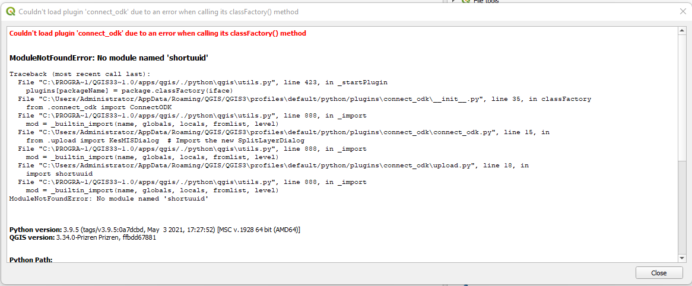
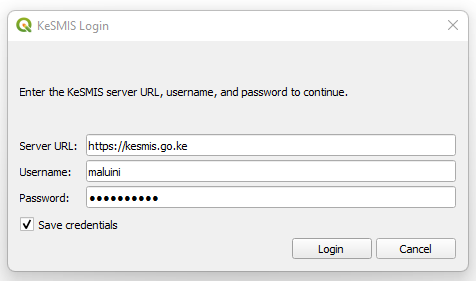
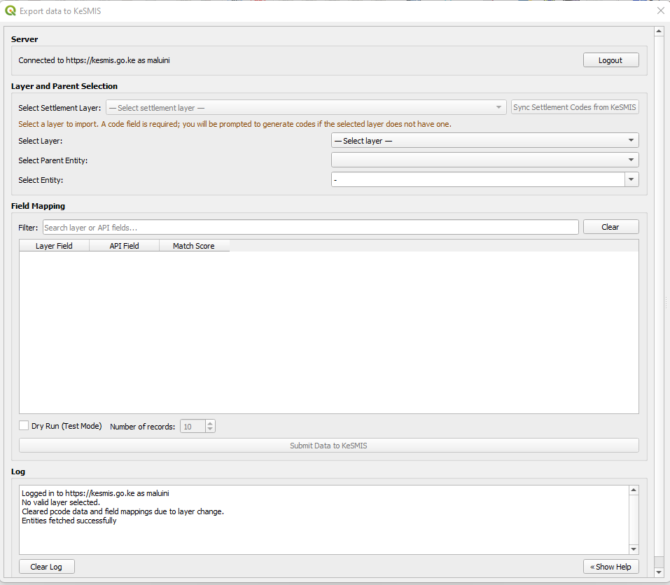

# Connector for ODK — User Manual

**Version 1 — Administrator** (includes KeSMIS Import)  
**Plugin version 2.0**  
**Author:** Felix Mutua · [mutua@ags.co.ke](mailto:mutua@ags.co.ke)  
**Homepage:** [https://github.com/fnmutua/connector-for-ODK](https://github.com/fnmutua/connector-for-ODK)

---

## 1. Introduction

**Connector for ODK** is a QGIS plugin with four tools:


| Tool            | Purpose                                                                |
| --------------- | ---------------------------------------------------------------------- |
| **Get Data**    | Download ODK Central form submissions and load them as map layers      |
| **Split Layer** | Split a vector layer into separate layers by attribute value           |
| **QA/QC**       | Run quality checks on File Geodatabase layers and export issue reports |
| **Import**      | Upload QGIS vector features to a KeSMIS server                         |


Each dialog includes a collapsible **Help** panel. The QA/QC dialog opens with help visible; other tools show **« Show Help** to open it.


*Figure 1 — QGIS menu and toolbar with Get Data, Split Layer, QA/QC, and Import*

---

## 2. Prerequisites

### 2.1 QGIS

- **QGIS 3.0 or later** (desktop)
- An internet connection for ODK Central, KeSMIS, and optional package installation

### 2.2 Python packages

The plugin installs missing packages automatically the first time it loads. If that fails, install dependencies manually using **OSGeo4W Shell** from your QGIS installation (Windows).

**Open OSGeo4W Shell**

1. Close QGIS.
2. Open **OSGeo4W Shell** from your QGIS installation folder — for example `C:\Program Files\QGIS 3.x\bin\OSGeo4W.bat` — or from the Windows Start menu under your QGIS install (e.g. **QGIS Desktop → OSGeo4W Shell**).

> Use the OSGeo4W Shell that ships with the same QGIS version you use. Do not use a separate OSGeo4W install, or packages may install into the wrong Python environment.

**Install required packages**

Run this command in that shell:

```
python -m pip install numpy pandas geopandas fiona shapely pyproj fpdf2 requests fuzzywuzzy rapidfuzz shortuuid openpyxl xlsxwriter
```

Required packages:


| Package      | Used for                           |
| ------------ | ---------------------------------- |
| `numpy`      | Numerical processing               |
| `pandas`     | Tables and spreadsheets            |
| `geopandas`  | Spatial data handling              |
| `fiona`      | Reading/writing geospatial files   |
| `shapely`    | Geometry operations                |
| `pyproj`     | Coordinate reference systems       |
| `fpdf2`      | QA/QC PDF reports (`import fpdf`)  |
| `requests`   | ODK Central and KeSMIS API calls   |
| `fuzzywuzzy` | Fuzzy field and attribute matching |
| `rapidfuzz`  | Fast field matching (Import)       |
| `shortuuid`  | Unique ID generation (Import)      |
| `openpyxl`   | Reading `dictionary.xlsx` (QA/QC)  |
| `xlsxwriter` | Writing QA/QC Excel outputs        |


*Figure 2 — Installing Python packages in OSGeo4W Shell from your QGIS installation folder*

**Troubleshooting: fixing a missing package error**

If QGIS shows a yellow bar such as *"Couldn't load plugin 'connect_odk'…"* or the **Message Log** reports `ModuleNotFoundError: No module named '…'`, a required Python package is not installed in the QGIS Python environment.



*Figure 3 — Plugin load error when a required Python package is missing*

Click **View message log** (or open **View → Panels → Log Messages → Python Error**) to see which package is missing.



*Figure 4 — Message log showing the missing package (example: `shortuuid`)*

**How to fix it**

1. Note the **package name** in the error (the name inside quotes after `No module named`).
2. **Close QGIS** completely.
3. Open **OSGeo4W Shell** from your QGIS installation folder (see above).
4. Install the missing package. You can install **all** required packages (recommended):

```
python -m pip install numpy pandas geopandas fiona shapely pyproj fpdf2 requests fuzzywuzzy rapidfuzz shortuuid openpyxl xlsxwriter
```

   Or install **only the missing package** (replace `shortuuid` with the name from your error):

```
python -m pip install shortuuid
```

5. **Restart QGIS**. Connector for ODK should load without the error.

### 2.3 Data and access

Depending on which tools you use, you may also need:

- **Get Data** — ODK Central URL, username, and password
- **Split Layer** — Vector layers already loaded in the QGIS project
- **QA/QC** — An ESRI File Geodatabase (`.gdb` folder)
- **Import** — KeSMIS server URL, username, and password; vector layers loaded in QGIS

---

## 3. Installing the Plugin

### Option A — QGIS Plugin Repository (recommended)

1. Open **QGIS**.
2. Go to **Plugins → Manage and Install Plugins**.
3. Search for **Connector for ODK**.
4. Click **Install Plugin**.
5. Restart QGIS if prompted.


*Figure 5 — Plugin Manager with Connector for ODK selected*

### Option B — Install from ZIP

1. Download `connect_odk.zip` (version 2.0).
2. In QGIS, go to **Plugins → Manage and Install Plugins**.
3. Open the **Install from ZIP** tab.
4. Select the ZIP file and click **Install Plugin**.
5. Restart QGIS if prompted.


*Figure 6 — Installing the plugin from a ZIP file*

### Verify installation

After QGIS restarts, you should see:

- Menu: **Plugins → Connector for ODK**
- Toolbar icons for **Get Data**, **Split Layer**, **QA/QC**, and **Import**


*Figure 7 — Plugins menu with all four tools listed*

---

## 4. Get Data (ODK Central)

Download ODK form submissions and add them to your map.


*Figure 8 — Get Data dialog with ODK Central login*

### Steps

1. Open **Plugins → Connector for ODK → Get Data**.
2. Enter your **ODK Central URL**, **username**, and **password**.
3. Click **Login** to load projects and forms.
4. Select a **project** and **form**.
5. Click **Process Form** to fetch submissions and add a GeoJSON layer to the map.
6. Optionally click **Get CSV** to export the data as a spreadsheet.


*Figure 9 — Project and form selected before processing*


*Figure 10 — Submissions loaded as a layer on the QGIS map*

### Notes

- Use **Save Credentials** to store your URL and login for next time.
- Output is in **EPSG:4326** (WGS 84).
- A `submissions.json` file is written to the working folder.
- Check the **Log** panel at the bottom of the dialog for progress and errors.


*Figure 11 — Collapsible help panel in Get Data*

---

## 5. Split Layer

Create separate in-memory layers for each unique value in a chosen attribute field.

### Steps

1. Load the source vector layer in QGIS.
2. Open **Plugins → Connector for ODK → Split Layer**.
3. Choose a **Layer** from the project.
4. Choose the **Field** to split on.
5. Click **Split Layer**.


*Figure 12 — Split Layer dialog*

### Result

After splitting:

- One new layer is created per unique non-null value.
- Layers are named `{layer}_{value}`.
- Empty fields are dropped from each split layer.
- Geometry and CRS are copied from the source.

---

## 6. QA/QC

Run quality checks on File Geodatabase layers and export issue layers, spreadsheets, and a PDF summary.

### Steps

1. Open **Plugins → Connector for ODK → QA/QC**. The dialog opens with the help panel visible.
2. From **Quick start** step 2 in the help panel, download the **template geodatabase** and **dictionary.xlsx** for reference when aligning your data (see below).
3. Click **Select GeoDatabase** and choose the folder containing your `.gdb`. Use the template to structure new submissions.
4. Click **Select Output Folder** for reports and issue layers.
5. Adjust **parameters** if needed (angle and length thresholds).
6. Under **Select Layers**, tick the layers to check, or use **Select All**. The layer list scrolls inside a fixed panel so **Run All Checks** stays visible.
7. Click **Run All Checks**.
8. When finished, use the **PDF Report** and **Open Output Folder** links below the log.


*Figure 13 — QA/QC interface*

### Checks performed


| Check                | Description                                   |
| -------------------- | --------------------------------------------- |
| Duplicate geometries | Features with identical geometry              |
| Duplicate attributes | Rows with identical non-geometry fields       |
| Overlapping polygons | Polygon pairs sharing area above 0.01 m²      |
| Line issues          | Sharp turns and self-intersections            |
| Short lines          | Line features shorter than the minimum length |
| Attribute issues     | Fields validated against `dictionary.xlsx`    |


### Parameters (defaults)


| Parameter  | Default | Purpose                             |
| ---------- | ------- | ----------------------------------- |
| Min Angle  | 1°      | Lower bound for flagged turn angles |
| Max Angle  | 45°     | Upper bound for flagged turn angles |
| Min Length | 10 m    | Flag lines shorter than this        |


*Figure 14 — Completed run with report and output folder links*

### Template geodatabase and attribute dictionary

The template geodatabase and attribute dictionary are **reference materials** for packaging and QA/QC. They describe the expected layer names, fields, types, and geometry so your `.gdb` aligns with the real submission structure. Download copies from **Quick start** step 2 in the QA/QC help panel.

1. **Download template geodatabase** — shows the expected layer layout. Use it as a guide when building or checking your geodatabase.
2. **Download dictionary.xlsx** — lists the field names, types, and geometry for each layer. Open the **How to** sheet for column definitions; every other sheet describes one layer.
3. **Using both together** — consultants use the template and dictionary as reference when packaging data so layers and attributes match what QA/QC expects.
4. **Help panel downloads** — links open a save dialog without clearing the help text.


*Figure 15 — Help panel showing template geodatabase and dictionary download links*

### Outputs

For each layer and issue type, `.gpkg` and `.xlsx` files are written to the output folder. A summary PDF (`database_summary_report.pdf`) is also created. Existing output files are overwritten on re-run.


*Figure 16 — Example QA/QC output files in the output folder*

---

## 7. Import (KeSMIS)

Upload QGIS vector layer features to a KeSMIS server with automatic field mapping and parent-entity assignment.

### KeSMIS login

When you open **Import**, a **KeSMIS Login** popup appears first. You must enter the **server URL**, **username**, and **password** and click **Login** before the main import dialog opens. Click **Cancel** to abort.

- **Save credentials** stores your URL, username, password, and session token for next time.
- If a saved token is still valid, the popup shows **Logging in…** with a progress bar and opens the import dialog automatically.
- If the token has expired, the full login form is shown so you can sign in again.



*Figure 17 — KeSMIS Login popup*



*Figure 18 — Import dialog after login (Server status, Logout, layer selection, field mapping)*

### Overview

After login, the import dialog is organized top to bottom:

1. **Server** — shows `Connected to {url} as {username}`. Click **Logout** to sign out and close the dialog (clears the saved session token).
2. **Settlement codes** (recommended first) — sync official KeSMIS codes into settlement layers before upload.
3. **Select Layer** — choose the vector layer to export (starts empty until you pick one).
4. **Select Parent Entity** — choose `settlement` or `ward` for spatial parent matching.
5. **Select Entity** — choose the API model to submit to; field matching runs after you confirm your choice.
6. **Field Mapping** — review or adjust automatic field matches, then submit.

Plugin dialogs stay scoped to the QGIS window and do not float over other applications.

### Settlement codes (recommended first step)

If your upload layer is a **settlement layer** (layer name contains `settlement`, excluding reference layers ending in ` Boundaries`), use KeSMIS codes — do not generate random UUIDs. Each settlement feature needs the **same `code` as KeSMIS** so imports **update existing records** instead of creating **duplicate settlements** on the server.

1. Open **Plugins → Connector for ODK → Import** and complete the **KeSMIS Login** popup.
2. Under **Select Settlement Layer**, choose your settlement layer from the dropdown (nothing is pre-selected).
3. Click **Sync Settlement Codes from KeSMIS**. This matches your local features to official KeSMIS settlements by geometry and copies the server `code` onto your layer. Using those codes on import prevents duplicate settlement records when the same place already exists in KeSMIS.
4. Review the **Review Settlement Matches** table:
   - **One KeSMIS match** — the best overlap is selected automatically.
   - **Multiple KeSMIS matches** — choose the correct settlement from the dropdown for that row.
   - **No intersection** — a new short code is generated and shown before you confirm; you can proceed with that code.
5. Click **Transfer Codes** to apply codes to the layer.

After a successful sync, features are marked in the `kesmis_sync` field and syncing is disabled for that layer to protect official codes. To re-sync, remove the `kesmis_sync` field from the layer first.

### Upload workflow

1. Complete **KeSMIS Login** when the popup appears (see above).
2. **Select Layer** — choose the QGIS vector layer to export. The dropdown starts on **— Select layer —**; pick a layer explicitly.
3. **Code field check** — when you select a layer:
   - If the layer **already has a `code` field**, loading continues normally.
   - If the layer **has no `code` field** (and is not a settlement layer), you are prompted to **generate unique codes**. Choose **Yes** to add/fill codes, or **No** to cancel — import cannot continue without a `code` field.
   - If the selected layer **looks like a settlement layer**, you are directed to use **Sync Settlement Codes from KeSMIS** instead of generating random codes.
4. **Select Parent Entity** — choose `settlement` or `ward`. When prompted, download fresh parent boundaries from the server (recommended) or use a cached local GeoJSON file.
5. **Select Entity** — search or browse the entity list, then **click your choice** (or press Enter). Field matching starts only after you confirm the entity — browsing the list does not start matching early.
6. Review the **Field Mapping** table. Use the filter box to search rows. In each **API Field** cell:
   - Open the dropdown to see the **full list** of API fields (even when a match already exists).
   - Type to filter the list, or type a custom API field name if needed.
   - Choose **-** to clear a mapping.
7. **Dry run (optional)** — enable **Dry Run (Test Mode)** and set how many records to validate. Click **Validate on KeSMIS** to send a test batch with `dryRun: true`. Nothing is saved; the summary shows what would be inserted, updated, or failed, and any errors are listed in the dialog.
8. **Submit** — disable dry run and click **Submit Data to KeSMIS** for the full upload.

To sign out, click **Logout** in the **Server** section. The import dialog closes and the saved session token is cleared; open **Import** again to log in.

### Dry run

Enable **Dry Run (Test Mode)** to validate a limited number of records on the server **without saving anything**. Set the record count in the spin box next to the checkbox.

- The plugin sends `dryRun: true` to the KeSMIS import API.
- The server returns the same style of counts as a real import (`insertedCount`, `updatedCount`, `failedCount`).
- If any records fail validation, errors are shown in the **Dry Run Complete** dialog as well as in the log.
- When you are satisfied with the dry run, turn off dry run and submit for real.

---

## 8. Tips and Troubleshooting


| Issue                                | What to try                                                                                                 |
| ------------------------------------ | ----------------------------------------------------------------------------------------------------------- |
| Plugin does not appear after install | Restart QGIS. Check **Plugins → Manage and Install Plugins → Installed** that Connector for ODK is enabled. |
| Package install fails                | See **Fixing a missing package error** in Section 2.2. Close QGIS, open **OSGeo4W Shell** from your QGIS installation folder, install the missing package (or all packages), then restart QGIS. |
| ODK / KeSMIS login fails             | Confirm URL, username, and password in the **KeSMIS Login** popup. Check network access to the server. |
| KeSMIS session expired               | Open **Import** again and sign in. If auto-login fails, enter credentials manually. Use **Logout** to clear a stale session. |
| Import missing `code` field          | When you select a layer, choose **Yes** when prompted to generate codes. Settlement layers must use **Sync Settlement Codes from KeSMIS**, not random UUIDs. |
| Settlement codes wrong or missing    | Use **Select Settlement Layer** and **Sync Settlement Codes from KeSMIS** before upload. Pick the correct KeSMIS match when several overlap. |
| Field matching starts too early      | Finish selecting an entity by **clicking** it in the list (or pressing Enter). Browsing with arrow keys alone does not run matching. |
| API field dropdown looks empty       | Clear the search text in the cell, or click the dropdown arrow to reopen the full list. Matched fields still show all options when opened. |
| Dry run still saves data             | Ensure the KeSMIS server supports `dryRun: true` on `/api/v1/data/import/upsert`. The plugin sends dry run only when **Dry Run** is checked. |
| QA/QC attribute check skipped        | Ensure `dictionary.xlsx` has a sheet matching the layer name.                                               |
| No layers in a dropdown              | Load vector layers into the QGIS project first. Layer and settlement dropdowns start empty until you choose one. |


For updates, bug reports, and source code:

- **Tracker:** [https://github.com/fnmutua/connector-for-ODK](https://github.com/fnmutua/connector-for-ODK)  
- **Repository:** [https://github.com/fnmutua/ODK-Connect](https://github.com/fnmutua/ODK-Connect)

---

## Screenshot checklist


| Figure | File                            | What to capture                               |
| ------ | ------------------------------- | --------------------------------------------- |
| 1      | `figure1.png`                   | QGIS toolbar + Plugins menu                   |
| 2      | `figure2.png`                   | OSGeo4W Shell pip install (from QGIS install folder) |
| 3      | `figure-2b-stacktrace.png`      | Missing package error banner                  |
| 4      | `figure-2c-missingpackage.png`  | Message log with `ModuleNotFoundError`        |
| 5      | `figure3.png`                   | Plugin Manager search                         |
| 6      | `figure4.png`                   | Install from ZIP tab                          |
| 7      | `figure5.png`                   | Connector for ODK submenu                     |
| 8      | `figrue6-getdata.png`           | Get Data — login screen                       |
| 9      | `figure7.png`                   | Get Data — project/form selected              |
| 10     | `figure8.png`                   | Map with submissions layer                    |
| 11     | `figure9.png`                   | Get Data help panel                           |
| 12     | `figure15.png`                  | Split Layer dialog                            |
| 13     | `figure12a.png`                 | QA/QC — interface                             |
| 14     | `figure12b.png`                 | QA/QC — finished                              |
| 15     | `figure13.png`                  | QA/QC help + template & dictionary links      |
| 16     | `figure14.png`                  | Output folder contents                        |
| 17     | `figure10a-login.png`           | KeSMIS Login popup                            |
| 18     | `figure10b--afterlogin.png`    | Import — main dialog after login              |


---

*Connector for ODK v2.0 — Licensed under GPL-3.0*
