# Connector for ODK — User Manual

**Version 2 — Standard** (Get Data, Split Layer, and QA/QC)  
**Plugin version 2.0**  
**Author:** Felix Mutua · [mutua@ags.co.ke](mailto:mutua@ags.co.ke)  
**Homepage:** [https://github.com/fnmutua/connector-for-ODK](https://github.com/fnmutua/connector-for-ODK)

---

## 1. Introduction

**Connector for ODK** is a QGIS plugin with three tools:


| Tool            | Purpose                                                                |
| --------------- | ---------------------------------------------------------------------- |
| **Get Data**    | Download ODK Central form submissions and load them as map layers      |
| **Split Layer** | Split a vector layer into separate layers by attribute value           |
| **QA/QC**       | Run quality checks on File Geodatabase layers and export issue reports |


Each dialog includes a collapsible **Help** panel. Click **« Show Help** to open it.

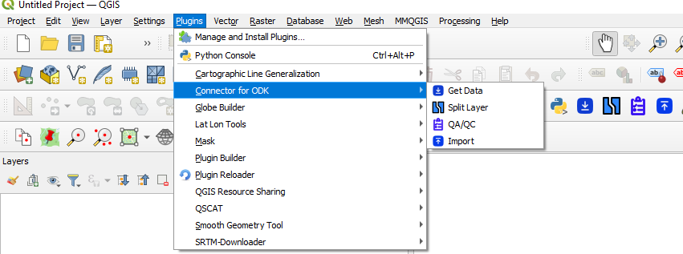

*Figure 1 — QGIS menu and toolbar with Get Data, Split Layer, and QA/QC*

---

## 2. Prerequisites

### 2.1 QGIS

- **QGIS 3.0 or later** (desktop)
- An internet connection for ODK Central and optional package installation

### 2.2 Python packages

The plugin installs missing packages automatically the first time it loads. If that fails, install dependencies manually using **OSGeo4W Shell** from your QGIS installation (Windows).

**Open OSGeo4W Shell**

1. Close QGIS.
2. Open **OSGeo4W Shell** from your QGIS installation folder — for example `C:\Program Files\QGIS 3.x\bin\OSGeo4W.bat` — or from the Windows Start menu under your QGIS install (e.g. **QGIS Desktop → OSGeo4W Shell**).

> Use the OSGeo4W Shell that ships with the same QGIS version you use. Do not use a separate OSGeo4W install, or packages may install into the wrong Python environment.

**Install required packages**

Run this command in that shell:

```
python -m pip install numpy pandas geopandas fiona shapely pyproj fpdf2 requests fuzzywuzzy openpyxl xlsxwriter
```

Required packages:


| Package      | Used for                           |
| ------------ | ---------------------------------- |
| `numpy`      | Numerical processing               |
| `pandas`     | Tables and spreadsheets            |
| `geopandas`  | Spatial data handling              |
| `fiona`      | Reading/writing geospatial files   |
| `shapely`    | Geometry operations                |
| `pyproj`     | Coordinate reference systems       |
| `fpdf2`      | QA/QC PDF reports (`import fpdf`)  |
| `requests`   | ODK Central API calls              |
| `fuzzywuzzy` | Fuzzy field and attribute matching |
| `openpyxl`   | Reading `dictionary.xlsx` (QA/QC)  |
| `xlsxwriter` | Writing QA/QC Excel outputs        |


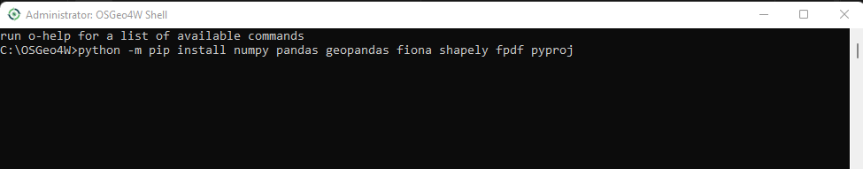

*Figure 2 — Installing Python packages in OSGeo4W Shell from your QGIS installation folder*

### 2.3 Data and access

Depending on which tools you use, you may also need:

- **Get Data** — ODK Central URL, username, and password
- **Split Layer** — Vector layers already loaded in the QGIS project
- **QA/QC** — An ESRI File Geodatabase (`.gdb` folder)

---

## 3. Installing the Plugin

### Option A — QGIS Plugin Repository (recommended)

1. Open **QGIS**.
2. Go to **Plugins → Manage and Install Plugins**.
3. Search for **Connector for ODK**.
4. Click **Install Plugin**.
5. Restart QGIS if prompted.

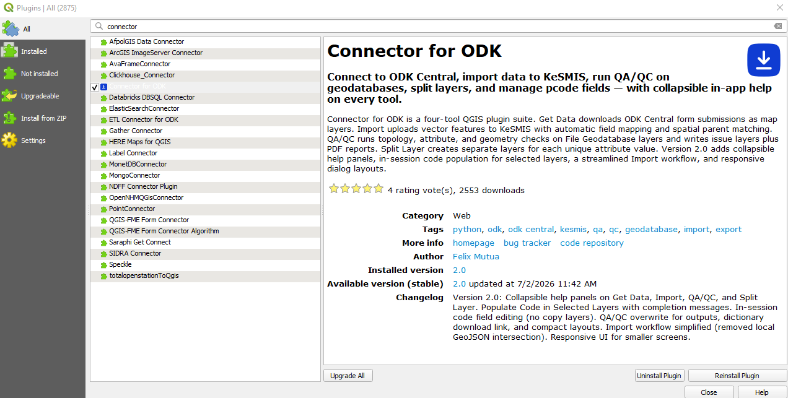

*Figure 3 — Plugin Manager with Connector for ODK selected*

### Option B — Install from ZIP

1. Download `connect_odk.zip` (version 2.0).
2. In QGIS, go to **Plugins → Manage and Install Plugins**.
3. Open the **Install from ZIP** tab.
4. Select the ZIP file and click **Install Plugin**.
5. Restart QGIS if prompted.

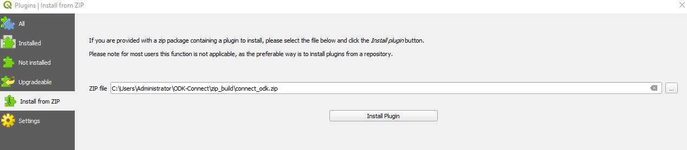

*Figure 4 — Installing the plugin from a ZIP file*

### Verify installation

After QGIS restarts, you should see:

- Menu: **Plugins → Connector for ODK**
- Toolbar icons for **Get Data**, **Split Layer**, and **QA/QC**


*Figure 5 — Plugins menu with Get Data, Split Layer, and QA/QC*

---

## 4. Get Data (ODK Central)

Download ODK form submissions and add them to your map.

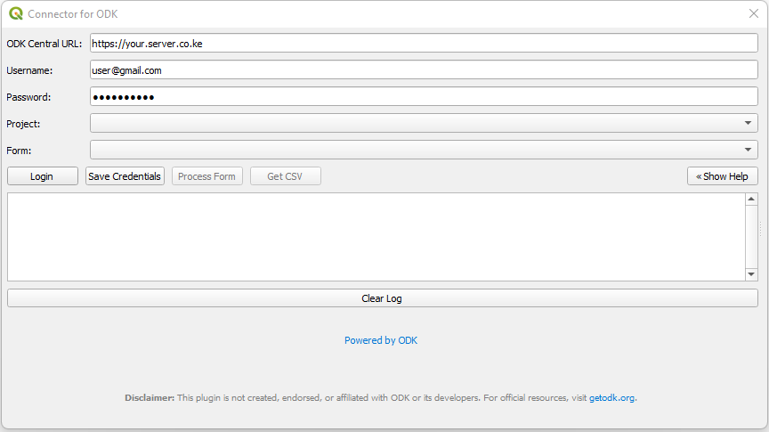

*Figure 6 — Get Data dialog with ODK Central login*

### Steps

1. Open **Plugins → Connector for ODK → Get Data**.
2. Enter your **ODK Central URL**, **username**, and **password**.
3. Click **Login** to load projects and forms.
4. Select a **project** and **form**.
5. Click **Process Form** to fetch submissions and add a GeoJSON layer to the map.
6. Optionally click **Get CSV** to export the data as a spreadsheet.

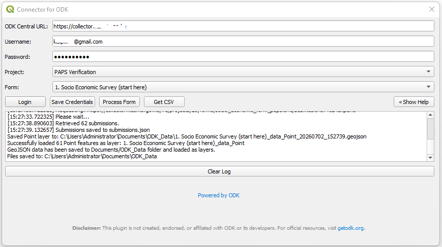

*Figure 7 — Project and form selected before processing*

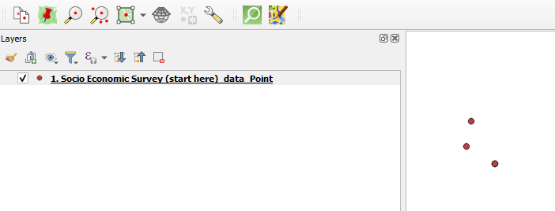

*Figure 8 — Submissions loaded as a layer on the QGIS map*

### Notes

- Use **Save Credentials** to store your URL and login for next time.
- Output is in **EPSG:4326** (WGS 84).
- A `submissions.json` file is written to the working folder.
- Check the **Log** panel at the bottom of the dialog for progress and errors.

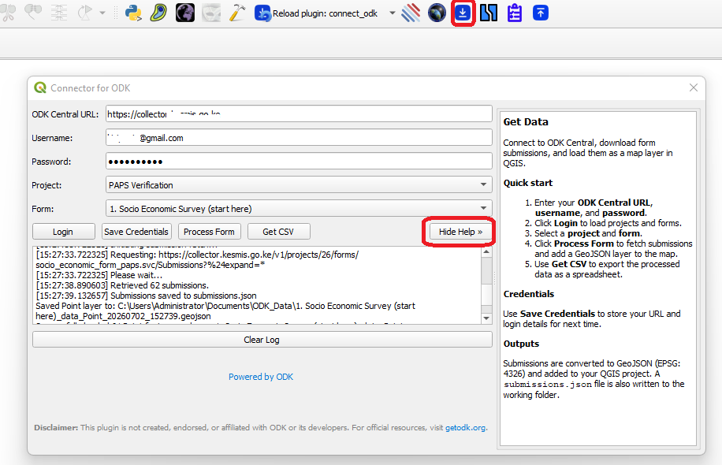

*Figure 9 — Collapsible help panel in Get Data*

---

## 5. Split Layer

Create separate in-memory layers for each unique value in a chosen attribute field.

### Steps

1. Load the source vector layer in QGIS.
2. Open **Plugins → Connector for ODK → Split Layer**.
3. Choose a **Layer** from the project.
4. Choose the **Field** to split on.
5. Click **Split Layer**.

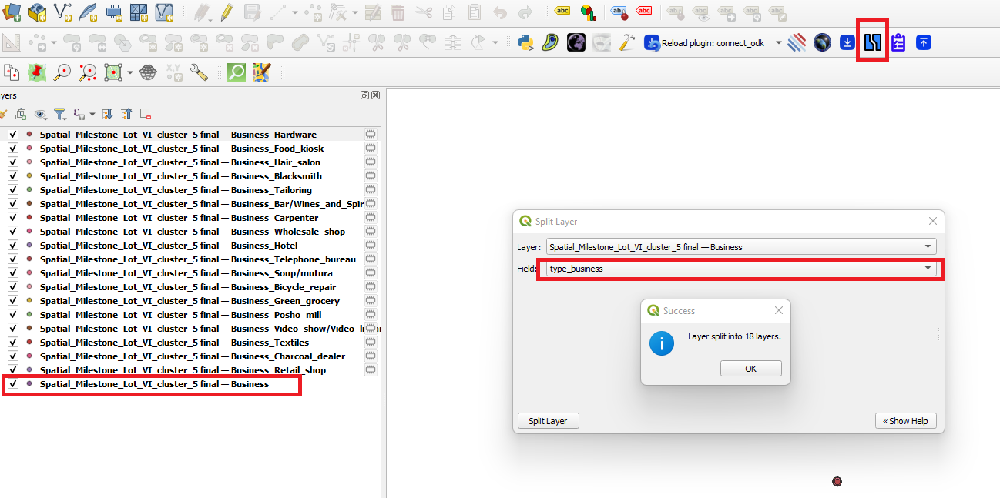

*Figure 10 — Split Layer dialog*

### Result

After splitting:

- One new layer is created per unique non-null value.
- Layers are named `{layer}_{value}`.
- Empty fields are dropped from each split layer.
- Geometry and CRS are copied from the source.

---

## 6. QA/QC

Run quality checks on File Geodatabase layers and export issue layers, spreadsheets, and a PDF summary.

### Steps

1. Open **Plugins → Connector for ODK → QA/QC**.
2. Click **Select GeoDatabase** and choose the folder containing your `.gdb`.
3. Click **Select Output Folder** for reports and issue layers.
4. Adjust **parameters** if needed (angle and length thresholds).
5. Under **Select Layers**, tick the layers to check, or use **Select All**.
6. Click **Run All Checks**.
7. When finished, use the **PDF Report** and **Open Output Folder** links below the log.

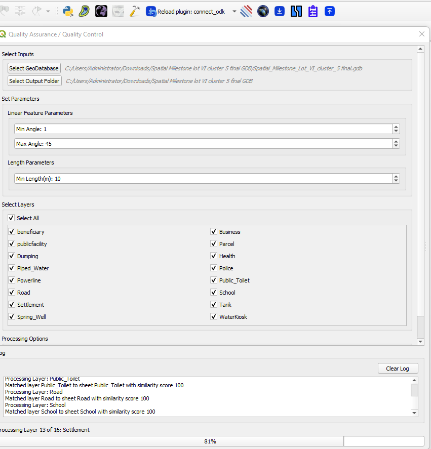

*Figure 11 — QA/QC interface*

### Checks performed


| Check                | Description                                   |
| -------------------- | --------------------------------------------- |
| Duplicate geometries | Features with identical geometry              |
| Duplicate attributes | Rows with identical non-geometry fields       |
| Overlapping polygons | Polygon pairs sharing area above 0.01 m²      |
| Line issues          | Sharp turns and self-intersections            |
| Short lines          | Line features shorter than the minimum length |
| Attribute issues     | Fields validated against `dictionary.xlsx`    |


### Parameters (defaults)


| Parameter  | Default | Purpose                             |
| ---------- | ------- | ----------------------------------- |
| Min Angle  | 1°      | Lower bound for flagged turn angles |
| Max Angle  | 45°     | Upper bound for flagged turn angles |
| Min Length | 10 m    | Flag lines shorter than this        |


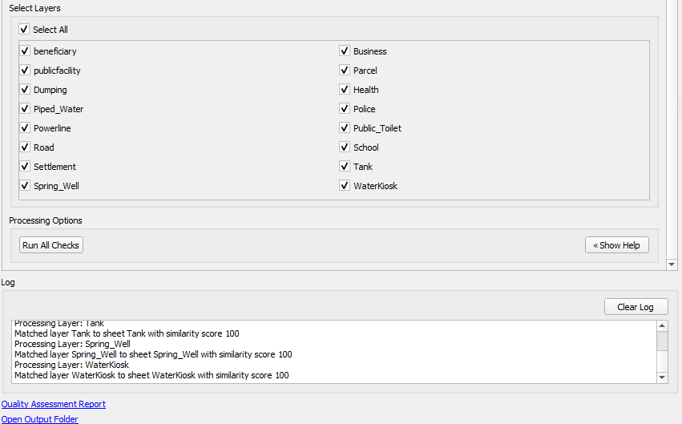

*Figure 12 — Completed run with report and output folder links*

### Attribute dictionary

`dictionary.xlsx` is bundled with the plugin. Each sheet should match a layer name and include columns **Attribute**, **Type**, and optionally **LEN** and **Options**. You can download a copy from the help panel link inside the QA/QC dialog.

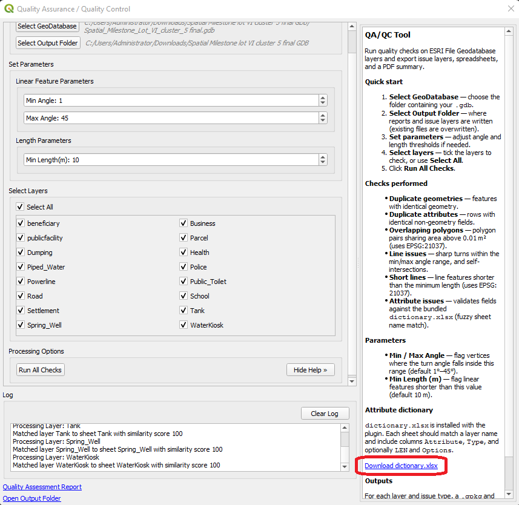

*Figure 13 — Help panel showing dictionary download link*

### Outputs

For each layer and issue type, `.gpkg` and `.xlsx` files are written to the output folder. A summary PDF (`database_summary_report.pdf`) is also created. Existing output files are overwritten on re-run.

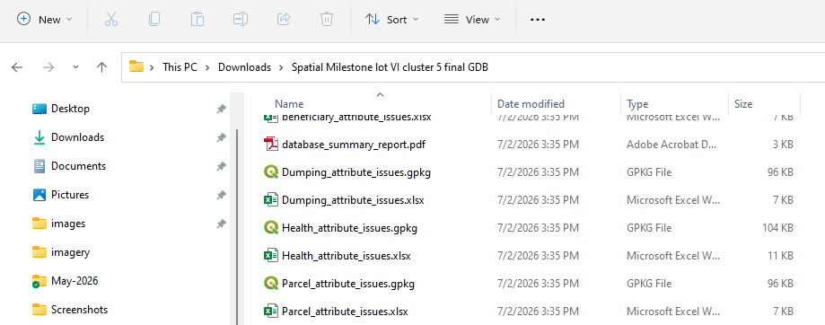

*Figure 14 — Example QA/QC output files in the output folder*

---

## 7. Tips and Troubleshooting


| Issue                                | What to try                                                                                                 |
| ------------------------------------ | ----------------------------------------------------------------------------------------------------------- |
| Plugin does not appear after install | Restart QGIS. Check **Plugins → Manage and Install Plugins → Installed** that Connector for ODK is enabled. |
| Package install fails                | Close QGIS. Open **OSGeo4W Shell** from your QGIS installation folder, then install packages as shown in Section 2.2. |
| ODK login fails                      | Confirm URL, username, and password. Check network access to ODK Central.                                   |
| QA/QC attribute check skipped        | Ensure `dictionary.xlsx` has a sheet matching the layer name.                                               |
| No layers in a dropdown              | Load vector layers into the QGIS project first.                                                             |


For updates, bug reports, and source code:

- **Tracker:** [https://github.com/fnmutua/connector-for-ODK](https://github.com/fnmutua/connector-for-ODK)  
- **Repository:** [https://github.com/fnmutua/ODK-Connect](https://github.com/fnmutua/ODK-Connect)

---

## Screenshot checklist


| Figure | File                  | What to capture                               |
| ------ | --------------------- | --------------------------------------------- |
| 1      | `figure1.png`         | QGIS toolbar + Plugins menu                   |
| 2      | `figure2.png`         | OSGeo4W Shell pip install (from QGIS install folder) |
| 3      | `figure3.png`         | Plugin Manager search                         |
| 4      | `figure4.png`         | Install from ZIP tab                          |
| 5      | `figure5.png`         | Connector for ODK submenu                     |
| 6      | `figrue6-getdata.png` | Get Data — login screen                       |
| 7      | `figure7.png`         | Get Data — project/form selected              |
| 8      | `figure8.png`         | Map with submissions layer                    |
| 9      | `figure9.png`         | Get Data help panel                           |
| 10     | `figure15.png`        | Split Layer dialog                            |
| 11     | `figure12a.png`       | QA/QC — interface                             |
| 12     | `figure12b.png`       | QA/QC — finished                              |
| 13     | `figure13.png`        | QA/QC help + dictionary link                  |
| 14     | `figure14.png`        | Output folder contents                        |


---

*Connector for ODK v2.0 — Licensed under GPL-3.0*
